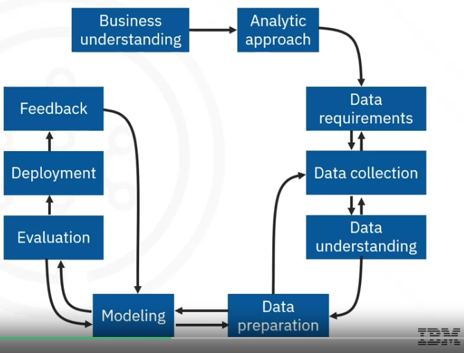

# Data Science Methodology

## From Problem to Approach and From Requirements to Collection

### Problem to Approach

### From Requirements to Collection

## From Understanding to Preparation and From Modeling to Evaluation

### From Understanding to Prepration

### From Modeling to Evaluation

## From Deployment to Feedback and Final Evaluation

